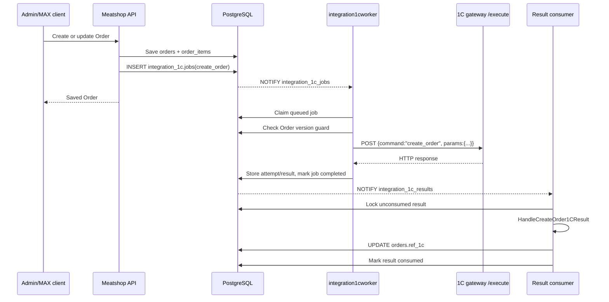

# Order creation and synchronization with 1C

This document describes the **current backend implementation** of Order creation/synchronization with 1C. It traces the code from an Order save request through the PostgreSQL queue, the embedded 1C worker, the HTTP call to the 1C gateway, and result application back to `public.orders`.

The relevant code is concentrated in:

- `internal/services/order_cust.go` — admin Order aggregate create/update;
- `internal/services/maxMiniApp.go` — MAX mini-app Order create/update;
- `internal/services/order1c.go` — building and enqueueing `create_order`, plus applying its result;
- `internal/integration1c/create_order.go` — 1C command request/response types;
- `internal/integration1cworker/` — durable PostgreSQL worker, retries, result journal and consumer;
- `cmd/meatshop/integration1cworker.go` — project-specific worker wiring and stale-version guard;
- `migrations/000026_integration_1c_queue.up.sql` — queue/journal tables and notifications;
- `migrations/000027_order_create_1c.up.sql` — active-job uniqueness and permission.

## 1. High-level flow



The user-facing Order request is synchronous only with respect to the **local database save and queue insertion**. The actual 1C call is asynchronous.

## 2. Where synchronization starts

There are three entry paths.

### 2.1 Admin Order create

HTTP route:

```http
POST /api/order
```

Route registration is in `internal/httpapi/orderDocument_cust.go` and invokes:

```text
OrderService.Create
```

Implementation: `internal/services/order_cust.go`.

Inside one primary-database transaction the service:

1. validates the complete `OrderDocument`;
2. inserts the `public.orders` row and reads its generated `id` and `version`;
3. writes all `public.order_items` through `syncOrderItems`;
4. rebuilds product-register actions;
5. calls `enqueueOrder1CSync(orderID, version)`;
6. reads and returns the complete Order detail;
7. commits the transaction.

The queue insert is therefore part of the same database transaction as the Order save.

**Consequence:** if `enqueueOrder1CSync` rejects the Order, the whole Order create transaction is rolled back. For example, an Order cannot currently be saved through this path if its customer or one of its products has no required 1C reference.

### 2.2 Admin Order update

HTTP route:

```http
PUT /api/order/{id}
```

It invokes `OrderService.Update` in `internal/services/order_cust.go`.

The service:

1. validates the aggregate and requires a positive `version`;
2. locks the Order row with `FOR UPDATE`;
3. compares the submitted version with the database version;
4. returns HTTP conflict semantics if another request already changed the Order;
5. updates the Order and increments `orders.version`;
6. synchronizes item rows;
7. rebuilds product-register actions;
8. calls `enqueueOrder1CSync(orderID, newVersion)`;
9. returns the complete Order detail;
10. commits.

Every successful local edit therefore gets its own versioned 1C synchronization job.

### 2.3 MAX mini-app create/update

`MaxMiniAppService.CreateOrder` and `MaxMiniAppService.UpdateOrder` in `internal/services/maxMiniApp.go` follow the same principle.

After saving the Order/items and rebuilding product-register actions they call:

```go
enqueueOrder1CSync(ctx, tx, orderID, version)
```

The MAX transaction is also rolled back if enqueue preparation fails.

### 2.4 Manual re-enqueue endpoint

There is also an explicit admin endpoint:

```http
POST /api/order/{id}/create-1c
```

Permission:

```text
order.create1c
```

It invokes `OrderService.Create1C` in `internal/services/order1c.go`.

The method locks the Order, reads its current version and calls the same `enqueueOrder1CSync` helper. This endpoint is therefore a manual way to enqueue synchronization for the current local Order version.

## 3. Preparing the `create_order` job

The central function is:

```text
enqueueOrder1CSync
```

in `internal/services/order1c.go`.

### 3.1 Basic identity validation

The function requires:

- `orderID > 0`;
- `orderVersion > 0`.

### 3.2 Customer 1C reference

It joins `public.orders` to `public.customers` and loads:

```text
customers.ref_1c
```

`customers.ref_1c` is a JSONB reference with `id` and `descr` fields. The
integration reads its `id`; it must be non-null and non-empty.

`customer_sale_places.ref_1c` uses the same JSONB shape. The current Order
synchronization still uses the customer-level reference; choosing whether a
sale-place reference should override it remains a separate business rule.

If it is absent, enqueueing fails with:

```text
order customer has no 1c reference
```

### 3.3 Product rows and quantities

`order1CProducts` reads Order lines ordered by `line_num, id`:

```sql
SELECT
    item.line_num,
    product.ref_1c->>'id',
    COALESCE(item.quant, item.quant_required)::double precision
FROM public.order_items item
JOIN public.products product ON product.id = item.product_id
WHERE item.order_id = $1
ORDER BY item.line_num, item.id;
```

For every row:

- `products.ref_1c->>'id'` must be non-empty;
- quantity sent to 1C is `COALESCE(item.quant, item.quant_required)`.

In normal Order validation `quant` is filled from `quant_required` when `quant <= 0`, so saved document rows normally have a positive `quant`.

The helper also rejects an Order with no item rows.

### 3.4 Exact command parameters

The backend creates `integration1c.CreateOrderParams` from `internal/integration1c/create_order.go`:

```json
{
  "order_id": 42,
  "order_version": 3,
  "customer_id": "customer-1c-uuid",
  "products": [
    {
      "id": "product-1c-uuid",
      "quant": 2.5
    }
  ]
}
```

The command name is:

```text
create_order
```

The Order ID and Order version are therefore sent to the 1C gateway as command parameters in the current implementation.

### 3.5 Metadata and correlation ID

The job gets project metadata:

```json
{
  "entity": "order",
  "order_id": 42,
  "order_version": 3
}
```

Its correlation ID is:

```text
order:42:v3
```

This gives each local Order version a separate synchronization identity.

### 3.6 Queue insert and duplicate handling

The job is inserted into:

```text
integration_1c.jobs
```

with an initial status of `queued`.

Migration `000027_order_create_1c.up.sql` creates a partial unique index for active `create_order` jobs with the same `(command, correlation_id)` while status is `queued` or `processing`.

The insert uses `ON CONFLICT DO NOTHING`. If an active job for the same Order version already exists, `enqueueOrder1CSync` reads that existing job and returns its ID/status instead of adding another active copy.

A previously **completed** job is outside this partial unique index. Consequently the manual endpoint can enqueue the same Order version again after its earlier job has completed.

## 4. PostgreSQL queue and wake-up mechanism

Migration `000026_integration_1c_queue.up.sql` creates three tables:

```text
integration_1c.jobs
integration_1c.attempts
integration_1c.results
```

Their responsibilities are:

- `jobs` — durable command queue and current execution state;
- `attempts` — one row for every technical execution attempt, including HTTP response/body or transport error;
- `results` — one terminal raw result for each job, later consumed by Meatshop business logic.

After a job insert, PostgreSQL trigger `jobs_notify_insert` executes:

```text
pg_notify('integration_1c_jobs', job_id)
```

This notification is only a low-latency wake-up. The queue itself is durable in PostgreSQL, and workers also poll, so losing a notification does not lose a job.

A similar trigger publishes `integration_1c_results` when a terminal result is inserted.

## 5. Embedded worker startup

`cmd/meatshop/main.go` calls:

```text
newIntegration1CWorkerRuntime
```

from `cmd/meatshop/integration1cworker.go`.

The worker starts only when:

```text
integration_1c.worker.enabled = true
```

The runtime uses:

- `integration_1c.url` as the 1C gateway base URL;
- the primary PostgreSQL DSN;
- configured worker concurrency, polling, retry, lock and timeout values.

`internal/integration1cworker/runtime.go` starts four cooperating loops:

1. PostgreSQL listener for `integration_1c_jobs`;
2. PostgreSQL listener for `integration_1c_results`;
3. one or more job workers;
4. one result consumer.

The project registers this result handler:

```go
integration.CommandCreateOrder: services.HandleCreateOrder1CResult
```

## 6. Claiming a queued job

`Store.ClaimNextJob` in `internal/integration1cworker/store.go` selects a ready job with:

```sql
FOR UPDATE SKIP LOCKED
```

ordered by priority and availability.

This permits multiple Meatshop processes/workers to share the same queue safely.

When claimed, the worker:

1. changes job status from `queued` to `processing`;
2. increments `attempt_count`;
3. records `locked_at` and `locked_by`;
4. creates a row in `integration_1c.attempts`;
5. commits the claim transaction.

## 7. Version guard before calling 1C

Meatshop installs a project-specific `JobGuard` in `cmd/meatshop/integration1cworker.go`.

For a versioned `create_order` job it reads `order_id` and `order_version` from job metadata and then reads the current `orders.version`.

The worker executes the 1C request only when:

```text
job.order_version == orders.version
```

If the Order was changed after this job was queued, the stale job is skipped.

If the Order no longer exists, the job is also skipped.

A skipped job is completed with a synthetic HTTP `204 No Content` result. This preserves a terminal journal record while avoiding an obsolete 1C call.

Legacy jobs without a positive `order_version` are allowed to execute for backward compatibility.

## 8. HTTP request sent to the 1C gateway

`GatewayClient.Execute` in `internal/integration1cworker/gateway.go` sends an HTTP `POST`.

If `integration_1c.url` does not already end with `/execute`, `/execute` is appended.

The request envelope is:

```json
{
  "command": "create_order",
  "params": {
    "order_id": 42,
    "order_version": 3,
    "customer_id": "customer-1c-uuid",
    "products": [
      {
        "id": "product-1c-uuid",
        "quant": 2.5
      }
    ]
  }
}
```

The generic worker intentionally does not interpret `params` and does not interpret the returned body. It persists the raw technical response first; project-specific interpretation happens later in the result consumer.

The HTTP request is bounded by the configured worker `job_timeout` through the job context.

## 9. Retry behavior

`WorkerService.handleJob` retries when there is:

- a transport error, such as connection failure or timeout;
- HTTP `408 Request Timeout`;
- HTTP `425 Too Early`;
- HTTP `429 Too Many Requests`;
- any HTTP status `>= 500`.

Retries use exponential backoff between configured `retry_base_delay` and `retry_max_delay` until `max_attempts` is exhausted.

Other HTTP responses, including HTTP 4xx responses such as 400, are terminal and are not retried.

Every attempt stores its raw technical information in `integration_1c.attempts`:

- HTTP status;
- content type;
- headers;
- response body;
- body size;
- or transport error.

## 10. Terminal result creation

When no further retry is scheduled, `Store.FinishAttempt` inserts one row into:

```text
integration_1c.results
```

The result outcome is one of:

```text
http_response
transport_error
```

The job itself is then marked:

```text
completed
```

There is no separate `failed` job status. A completed job can still represent HTTP 4xx/5xx or a terminal transport error; inspect `last_error`, attempts and result data to distinguish these cases.

Inserting the terminal result triggers:

```text
NOTIFY integration_1c_results
```

which wakes the result consumer.

## 11. Applying the 1C result to the Order

`ResultConsumer` in `internal/integration1cworker/result.go` selects an unconsumed terminal result using `FOR UPDATE ... SKIP LOCKED` and invokes the handler registered for its command.

For `create_order`, the handler is:

```text
HandleCreateOrder1CResult
```

in `internal/services/order1c.go`.

### 11.1 Resolving the local Order

The handler first reads `order_id` and `order_version` from job metadata.

For old jobs it can fall back to correlation IDs beginning with:

```text
order:<id>
```

If the referenced Order no longer exists, the result is simply consumed without updating any Order.

### 11.2 Which results can update `orders.ref_1c`

The handler ignores:

- transport-error results;
- non-2xx HTTP responses;
- HTTP `204 No Content`;
- invalid JSON response bodies;
- a response with `success: false`;
- a successful response without a non-empty payload ID.

Expected successful body:

```json
{
  "success": true,
  "payload": {
    "id": "1c-order-uuid",
    "descr": "Заказ покупателя 000001 от 02.09.2026"
  }
}
```

For such a result Meatshop stores:

```json
{
  "id": "1c-order-uuid",
  "descr": "Заказ покупателя 000001 от 02.09.2026"
}
```

into:

```text
public.orders.ref_1c
```

### 11.3 What is not changed by result consumption

The current handler does **not**:

- increment `orders.version`;
- set `orders.number_1c`;
- change Order status;
- modify Order items.

It only applies `orders.ref_1c` for a valid successful `create_order` response.

After the business handler succeeds, `ResultConsumer` sets `integration_1c.results.consumed_at` and `consumed_by` in the same transaction.

## 12. Stale jobs and concurrency

There are two different stale-job mechanisms.

### 12.1 Queued stale version

Before execution, the project `JobGuard` compares the job version with the current Order version. An outdated queued job is skipped with a synthetic 204 result and never reaches 1C.

Example:

```text
Order v1 -> job v1 queued
Order edited -> v2 -> job v2 queued
worker claims v1 -> current version is v2 -> v1 is skipped
worker claims v2 -> versions match -> v2 is sent to 1C
```

### 12.2 Abandoned processing job

`Store.RecoverStaleJobs` periodically finds `processing` jobs whose worker lock expired. It closes the abandoned attempt and either:

- returns the job to `queued` when attempts remain; or
- writes a terminal transport-error result when attempts are exhausted.

This makes a worker-process crash recoverable without Redis or an external message broker.

## 13. Important current behavior and caveats

### 13.1 Order save depends on 1C-reference completeness

Because `enqueueOrder1CSync` runs inside the same transaction as normal Order create/update, missing customer/product 1C references prevent the **local Order save** from committing.

This is intentional in the current code path, but it couples local document persistence to synchronization prerequisites.

### 13.2 `orders.ref_1c` does not change the command name

`enqueueOrder1CSync` does not check whether `orders.ref_1c` is already populated. Saving a previously synchronized Order still queues the command:

```text
create_order
```

There is currently no separate `update_order` command in this backend path.

Therefore the 1C-side `create_order` implementation must define the intended behavior for repeated versions of the same local Order. The backend supplies `order_id` and `order_version`, but does not choose a different command based on `ref_1c`.

### 13.3 Small race window after the pre-execution version guard

The version guard is checked **before** the HTTP call to 1C. If the Order changes while a matching job is already executing, the Order version can become newer before the old HTTP response is consumed.

`HandleCreateOrder1CResult` currently does not discard an older-version **successful HTTP 2xx body** solely because `order_version < currentVersion`; it only has special no-op handling for the synthetic 204 stale result.

So the pre-execution guard prevents ordinary stale queued jobs, but there is still a concurrency window for an Order edit that happens while a 1C request is already in flight.

### 13.4 Completed does not mean business success

`integration_1c.jobs.status = 'completed'` means the worker reached a terminal technical outcome. It does not necessarily mean that 1C created the Order successfully.

For diagnosis inspect:

- `integration_1c.jobs.last_error`;
- `integration_1c.attempts`;
- `integration_1c.results`;
- and whether `orders.ref_1c` was populated.

## 14. Monitoring jobs through the API

The queue has a read-only admin collection endpoint:

```http
GET /api/integration-1c/jobs
```

Permission:

```text
integration1c.jobs.list
```

It exposes the public projection of `integration_1c.jobs`, including:

- command;
- params;
- correlation ID;
- metadata;
- status;
- attempt counters;
- lock/worker information;
- last error;
- timestamps.

The attempts and results tables are currently internal database journal tables rather than public CRUD resources.

## 15. Practical trace for one new Order

For a newly created local Order `id=42`, `version=1`:

1. `OrderService.Create` inserts `public.orders(id=42, version=1)`.
2. Its items are persisted.
3. `enqueueOrder1CSync(..., 42, 1)` validates 1C references.
4. A job is created with correlation ID `order:42:v1`.
5. PostgreSQL notifies `integration_1c_jobs`.
6. A worker claims the job and creates attempt 1.
7. The guard verifies that Order 42 is still version 1.
8. The worker posts `create_order` to `<integration_1c.url>/execute`.
9. The raw response is stored in the attempt journal.
10. A terminal result is inserted and the job becomes `completed`.
11. PostgreSQL notifies `integration_1c_results`.
12. The result consumer calls `HandleCreateOrder1CResult`.
13. On a valid successful response, `orders.ref_1c` receives the returned 1C `{id, descr}`.
14. The result is marked consumed.
15. Later `GET /api/order/{id}/print-1c` sends `print_order` with
    `order_ids: [42]` and returns the PDF produced by 1C.

## 16. Batch printing and shipment creation

The Order integration now has three related batch commands. Every command
receives local numeric `orders.id` values in the same parameter object:

```json
{
	"order_ids": [42, 43]
}
```

The IDs are not values from `orders.ref_1c` or `orders.shipment_ref_1c`.

| Operation | Meatshop endpoint | 1C command | Execution | Permission |
| --- | --- | --- | --- | --- |
| Print Orders | `POST /api/order/print-1c` | `print_order` | Synchronous `/bin-data` PDF | `order.print1c` |
| Create shipments | `POST /api/order/create-shipments-1c` | `create_shipments` | Queued, then asynchronous `/execute` | `order.createShipments1c` |
| Print shipments | `POST /api/order/print-shipment-1c` | `print_shipment` | Synchronous `/bin-data` PDF | `order.printShipment1c` |

The existing `GET /api/order/{id}/print-1c` endpoint remains as a one-Order
wrapper around `print_order`.

Before any of these operations, every requested Order must exist and have
`orders.ref_1c.id`. `print_shipment` does not require a local
`shipment_ref_1c`: its wire contract identifies shipments by local
`order_ids`. Validation is performed for the complete batch before any request
is issued.

### 16.1 Queued shipment creation

The shipment flow is:

1. The client posts a non-empty array of unique positive Order IDs.
2. `OrderService.CreateShipments1C` locks and validates all selected Orders.
3. It inserts a queued `create_shipments` job and returns `202 Accepted` with
   `job_id` and `status`.
4. The generic worker posts the command and numeric ID array to 1C `/execute`.
5. The attempt and terminal result are written to the integration journal.
6. `HandleCreateShipments1CResult` consumes a successful response.
7. Keyed response entries update `orders.shipment_ref_1c`.

An identical active batch resolves to the same queued or processing job. This
deduplication uses a correlation hash derived from a sorted copy of the IDs; it
does not reorder the IDs sent to 1C.

The supported keyed result shape is:

```json
{
	"success": true,
	"payload": [
		{
			"order_id": 42,
			"id": "shipment-uuid-42",
			"descr": "Shipment 42"
		}
	]
}
```

`order_id` associates each returned 1C reference with its local Order. The
current mock response has an empty payload. It completes the technical job but
leaves `orders.shipment_ref_1c` unchanged. This does not block
`print_shipment`, which sends the same local `order_ids` to 1C.

### 16.2 Synchronous combined PDFs

`print_order` and `print_shipment` are sent directly to `/bin-data`; they do not
use the PostgreSQL job queue. Each request blocks until 1C returns one PDF.
Creating one sheet per requested document is handled by 1C, while Meatshop
validates the PDF and streams the same file to the caller.
